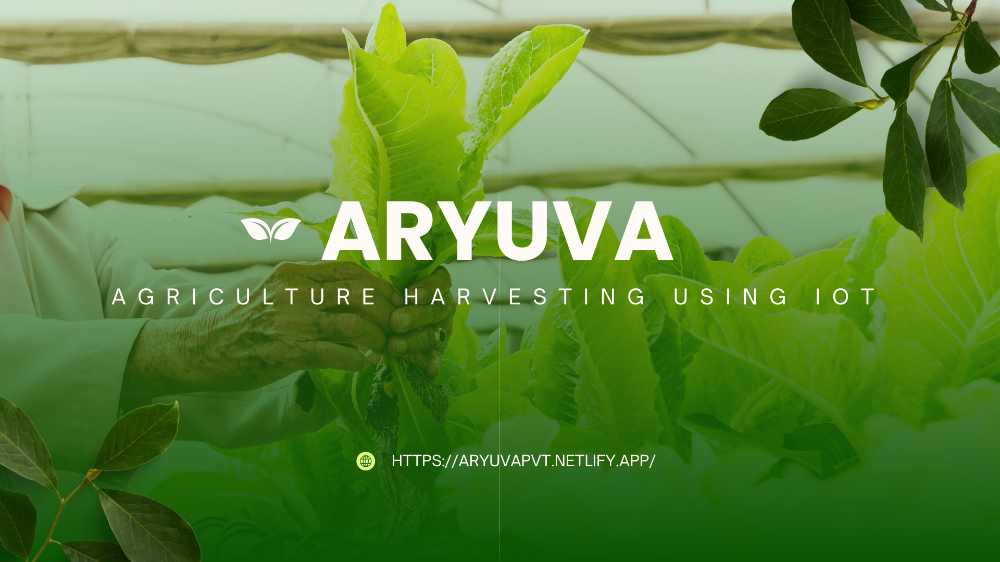

<h1 align="center">
    
</h1>

<h1 align="center">
  <a href="https://investsmartz.netlify.app/">Ayurva Pvt</a>
</h1>

<h3 align="center"></h3>

<p align="center">
  

  <a href="https://github.com/Mominuddin07/Aryuva-Project">
    
  </a>

  <a href="https://github.com/Mominuddin07/">
    
  </a>
</p>

<h4 align="center"> 
	 🚀 Status: Finished
</h4>

<p align="center">
 <a href="#about">About</a> •
 <a href="#features">Features</a> •
 <a href="#how-it-works">How it Works</a> •
 <a href="#technologies-used">Tech Stack</a> 
</p>

---

## About

**PROJECT - ARYUVA Pvt Ltd** is a pioneering startup dedicated to transforming the agricultural sector through innovative Internet of Things (IoT) applications. The website was created using Bootstrap for responsive and modern design.

---

## Features

- [x] Responsive Design  
- [x] Contact Form  
- [x] Impressive and Dynamic Web Experience  

---

##  How it Works

1. **Frontend** (this repository): Built using HTML, CSS, JS, Bootstrap.

### Pre-requisites

Before you begin, ensure you have the following tools installed on your machine:  
- [Git](https://git-scm.com)  
- [VSCode](https://code.visualstudio.com/) (or any code editor)  

### Running the Web Application (Frontend)

```bash
# Clone this repository
git clone https://github.com/Mominuddin07/Aryuva-Project.git

# Navigate to the project folder
cd Aryuva-Project

# Start the application
Run in terminal

# The application will run on http://localhost:3000


```

---


##  Tech Stack

The following tools were used in the construction of the project:
- **[HTML](https://developer.mozilla.org/en-US/docs/Web/HTML)** - Markup language for creating web pages.  
- **[CSS](https://developer.mozilla.org/en-US/docs/Web/CSS)** - Stylesheet language for designing web pages.  
- **[JavaScript](https://developer.mozilla.org/en-US/docs/Web/JavaScript)** - Programming language for dynamic web content.  
- **[Bootstrap](https://getbootstrap.com/)** - Framework for responsive, mobile-first web design.  


---

## Author

<a href="https://www.linkedin.com/in/mohammed-mominuddin-350180259/">

 <br />
 <p><b>Mohammed Mominuddin</b></p></a>
 
[](https://www.linkedin.com/in/mohammed-mominuddin-350180259/)


---


## Learn More

This project was created using HTML, CSS, JS, Bootstrap.
